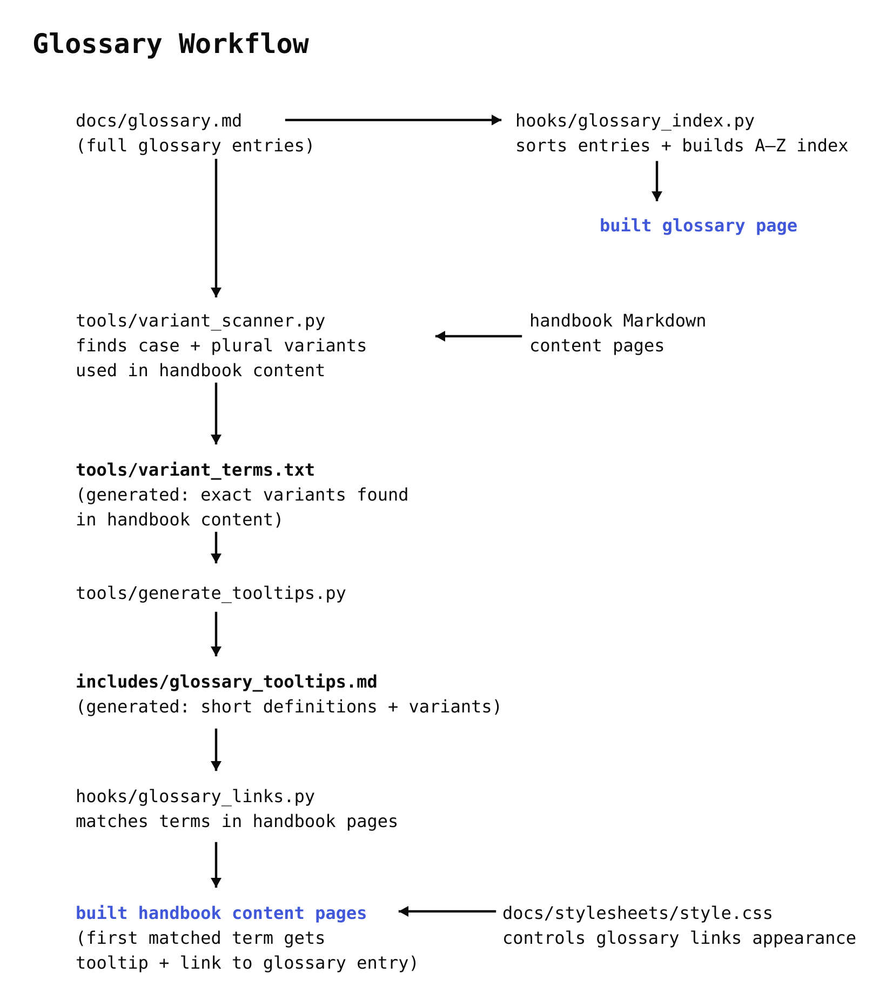

# Test Glossary for the CaRCC AI Facilitation Handbook

## Summary

A test site for adding a glossary to the [CaRCC AI Facilitation Handbook](https://carcc.github.io/CaRCC-AI-Facilitation-Handbook/). By default, the first occurrence of each glossary entry on a page is underlined. On desktop, it shows a short definition on hover and links to the full definition on the glossary page. The glossary page is automatically sorted and an A–Z index is generated at build time.

## Live Site

[https://lebriggs.github.io/carcc-ai-handbook-glossary-test/](https://lebriggs.github.io/carcc-ai-handbook-glossary-test/)

## How The Glossary Works

Both the test site and the handbook are built with MkDocs and Material for MkDocs.

The `abbr` Markdown extension finds glossary terms in the page text and adds the tooltip definition. A Python hook links the first occurrence of each glossary entry on a page to its full entry on the glossary page. When glossary terms overlap, `abbr` matches the longest term first, so Fairness assessment is matched before Fairness.

The tooltip file is generated from `glossary.md`. Each tooltip uses the first sentence of the full glossary definition. If more text follows the first sentence, the tooltip ends with [...] to show that the definition continues.

Term variants are generated by `tools/variant_scanner.py`. The scanner starts with the canonical terms in `glossary.md`, generates possible plural forms, and scans the handbook pages for case and plural variants that actually occur in the text. The exact forms found are written to `tools/variant_terms.txt` and use the same tooltip definition as their canonical glossary term.

On devices that do not support hover, the tooltip is turned off so tapping a term goes straight to the glossary entry.

A second Python hook builds the A–Z index at the top of the glossary page and adds a section heading before the first term under each letter. Letters with no entries stay as plain text in the index. Terms that do not begin with a letter file under a `0-9` heading, and accented letters file under their plain letter, so Überanpassung would appear under U. The hook also sorts the glossary entries alphabetically at build time.

The page text comes from real sections of the handbook. The glossary definitions are rough drafts used to test how the glossary works, not definitions for review.

## Exclusions

Glossary links are not added to:

- the glossary page itself
- headings
- table header cells
- terms that are already inside another link
- reference footnotes

## Workflow

 The glossary looks simple to a reader. Hover over a term, see the tooltip, and click through to the definition. Behind the scenes, it's a tiny bureaucracy of text processing.

**Figure 1:** Glossary workflow from source files to built handbook pages. Blue text marks built site outputs.

## Files

- `docs/glossary.md` contains the full glossary entries. It also holds the empty span that the A–Z index is written into at build time.
- `tools/variant_scanner.py` scans handbook content for case and plural variants of the canonical glossary terms.
- `tools/variant_terms.txt` is generated by `variant_scanner.py` and contains the exact term variants found in the handbook.
- `tools/generate_tooltips.py` generates `includes/glossary_tooltips.md` from the glossary definitions and generated term variants.
- `tools/update_terms.py` runs `variant_scanner.py` first, then `generate_tooltips.py`.
- `includes/glossary_tooltips.md` contains the terms that `abbr` looks for and the first sentence of each glossary definition. The tooltip definition must match the beginning of the full definition in `glossary.md`, because the hook uses that text to find the correct glossary entry.
- `hooks/glossary_links.py` adds links from glossary terms to their full entries.
- `hooks/glossary_index.py` sorts the glossary terms and builds the A–Z index and section headings.
- `docs/stylesheets/style.css` styles the glossary terms, tooltips, A–Z index, and section headings.

## Error Handling

During the MkDocs build:

- `glossary_links.py` warns if no glossary entry matches a tooltip definition and leaves the term as a tooltip without a link.
- `glossary_links.py` warns if a tooltip definition matches more than one glossary entry and lists the matching entries.
- `glossary_index.py` warns if glossary terms would use the same link and lists the conflicting terms.
- `glossary_index.py` warns if the A–Z index span is missing and leaves the glossary page as written without building the index.
- Build warnings are reported once per build and the site still builds.

During variant scanning and tooltip generation:

- `variant_scanner.py` warns if the same search form matches more than one glossary term, names the conflicting terms, and stops without generating the variant file.
- `generate_tooltips.py` warns if a glossary term has no definition, names the term, and stops without generating the tooltip file.
- `generate_tooltips.py` warns if the same canonical term appears more than once in `variant_terms.txt`, names the term, and stops before one entry can overwrite the other.
- Variant-scanning and tooltip-generation errors must be fixed before new files are generated.

## What The Glossary Needs In mkdocs.yaml

The glossary depends on the following settings in `mkdocs.yaml`:

- `hooks`, listing both `hooks/glossary_links.py` and `hooks/glossary_index.py`.
- `content.tooltips` under theme features, which is what draws the tooltip.
- `markdown_extensions`, all of it: `abbr` for the tooltip definitions, `attr_list` for the `{.glossary-page }` class on the glossary heading, and `pymdownx.snippets` with `auto_append` so the tooltip file is added to every page.
- `extra_css`, pointing at `stylesheets/style.css`.
- `watch`, including the `includes` directory so changes to the generated tooltip file trigger a local rebuild.

## Running The Test Site Locally

Python dependencies are listed in `requirements.txt`.

    py -m pip install -r requirements.txt

To generate `tools/variant_terms.txt` and `includes/glossary_tooltips.md` in the required order:

    py tools/update_terms.py

To run the scripts separately for testing:

    py tools/variant_scanner.py
    py tools/generate_tooltips.py

Then run the test site locally:

    py -m mkdocs serve

## Testing

The `tests.md` page contains the behavior tests and edge cases for the glossary.

## License

This project is licensed under the terms in the `LICENSE.md` file.
