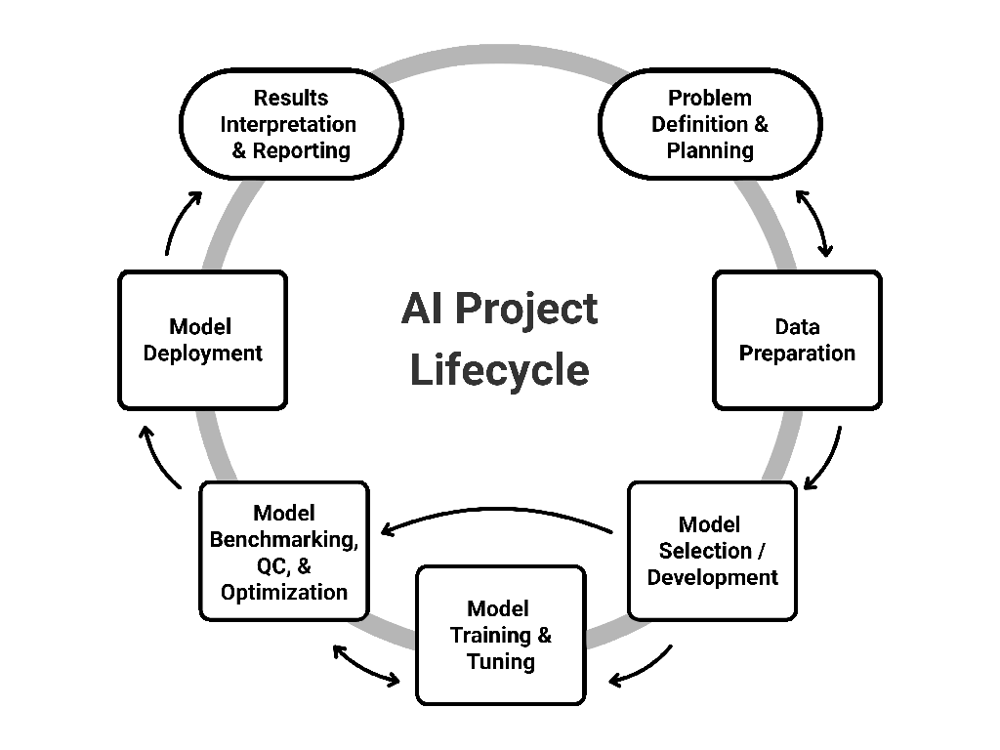

# CaRCC AI Facilitation Handbook

## Overview

This handbook guides Research Computing and Data (RCD) facilitators supporting users who run Artificial Intelligence (AI) and machine learning (ML) projects on shared research computing infrastructure. The aim is to help research teams move from exploratory AI ideas to reliable, reproducible, scalable, and sustainable outcomes. Designed for early- and mid-career facilitators, it assumes familiarity with high performance computing, shared AI platform infrastructure, and ML fundamentals. Researchers can also use the guide to see what their RCD teams can assist with, and when to involve them in a project.

As a community-driven living resource, the handbook is intended to grow across multiple chapters. The current chapter, the handbook’s first, walks through the seven stages of an AI project lifecycle. Focused on practical facilitation, the stages provide example user tasks, commonly used tools, challenges that arise, and ways RCD facilitators can address them. Each stage includes a list of selected learning resources. The chapter concludes with a cross-cutting section on considerations that are not tied to any single stage, such as ethics, compliance, and sustainability.

## Introduction

### Why AI Facilitation Matters In RCD

Research Computing and Data (RCD) professionals encompass a broad community of roles supporting research infrastructure and workflows, from system administrators and research software engineers to data scientists and security specialists. Among them, RCD facilitators play a particularly critical role in connecting exploratory research to reliable, sustainable outcomes. They collaborate with researchers, educators, students, staff, and external partners to co-create solutions that address complex computing and data needs [@alberAIProjectFacilitation2025; @schmitzAdvancingWorkforceThat2021].

In a landscape increasingly defined by the rapid growth and change brought about by Artificial Intelligence (AI), institutions face growing demands to support that transformation. The necessity for structured AI integration within RCD is echoed across national organizations and initiatives such as the Coalition for Academic Scientific Computation (CASC), National Science Foundation (NSF) AI Institutes, the National Artificial Intelligence Research Resource (NAIRR) Pilot, and Advanced Cyberinfrastructure Coordination Ecosystem: Services & Support (ACCESS). Collectively, these entities emphasize the need for strategic investments in cyberinfrastructure, workforce development, policy frameworks, and sustainable practices to enable effective, responsible AI adoption at scale [@boernerACCESSAdvancingInnovation2023; @bulekovaDynamicStateAI2024; @donlonNationalArtificialIntelligence2024; @StrengtheningDemocratizingUS2023; @USNAIRRPilot2024]. These investments build the institutional capacity to support AI, but that capacity must still be translated into support for individual research projects. RCD facilitators make that translation possible, helping researchers navigate needs that span multiple RCD roles [@schmitzAdvancingWorkforceThat2021]. For a single project, that can mean coordinating expertise in data governance, graphics processing unit (GPU) allocation, model licensing, and reproducibility of AI workflows.

### Who This Handbook Is For

This handbook is written for early- and mid-career RCD facilitators who are familiar with high performance computing and shared AI platform infrastructure. It is also useful to researchers who want to understand the infrastructure constraints and best practices that shape AI work on shared resources.

We define a researcher as someone who drives the scientific inquiry, provides domain expertise, and defines the core research problem and the interpretation of the output. An RCD facilitator, by contrast, bridges research and technology. Facilitators translate scientific problems into technical requirements, broker the compute, storage, and software resources a project needs, and connect researchers to the broader RCD professionals and institutional offices responsible for infrastructure, security, and compliance.

In practice, RCD facilitators and researchers work together throughout a project in a co-creation model. They interact continuously to balance performance, cost, security, and the responsible use of shared resources. Our aim in this handbook is to empower research teams to move from exploratory AI ideas to reliable, reproducible, scalable, and sustainable outcomes.

### What This Chapter Covers

This chapter, the first of the handbook, provides a structured, end-to-end facilitation reference for AI projects through the lens of RCD facilitators. A summarized version, The AI Project Lifecycle: Implementation Strategies and Tools [@joshiAIProjectLifecycle2026], is published on Zenodo. Future chapters for the handbook are planned, including user case studies, agentic AI, and AI platform development.

For the purposes of this chapter, "AI" covers both Artificial Intelligence and Machine Learning (ML) projects, across the full range of scale from classical models running on modest resources to large-scale model training. Because AI impacts a wide range of research domains, it is essential to use a lifecycle model that generalizes across diverse real-world use cases.

Our framework ([Figure 1](#figure-1)) maps each stage of a standardized AI workflow to specific tools and decision points. For each stage, we provide a definition, example tasks, the tools commonly used, the challenges researchers and educators encounter, the corresponding RCD implications and solutions, and selected learning resources. Cross-cutting considerations are treated in their own section, since they apply throughout rather than at a single stage.

Within that framework, the chapter's coverage is bounded by:

#### In-Scope Topics

The scope includes facilitation activities that connect research intent to practice, including resource brokerage (compute, storage, network, software), governance and compliance, risk and cost management, and practices for reproducibility and security. Governance and compliance considerations may include Data Use Agreements (DUAs), Institutional Review Board (IRB) requirements, Controlled Unclassified Information (CUI), and Protected Health Information (PHI).

#### Out-Of-Scope Topics

In-depth instruction in AI/ML mathematics and domain-specific scientific theory falls outside the scope of this chapter. Machine learning fundamentals are also not covered; readers looking for that grounding should consult one of the recommended introductory texts [@burkovHundredPageMachine2019; @geronHandsOnMachine2022].  

### How We Developed This Chapter

The chapter was developed in two steps: a survey to identify what the community needed, then a structured review of the literature and practice to address it. We surveyed the Campus Research Computing Consortium (CaRCC) AI Facilitation Interest Group [@CaRCCAIFacilitationIG]. While the 23 completed responses represent a focused subset of the broader CaRCC community, they point to current RCD priorities. The highest-ranked category on average was AI infrastructure and machine learning operations (MLOps) for research computing environments. Career development for facilitators, data management for AI workflows, AI governance and compliance, domain-specific case studies, and generative AI tools were grouped closely behind. The data management category included the Findable, Accessible, Interoperable, and Reusable (FAIR) principles. The results indicate priorities distributed across the facilitation landscape rather than one dominant need. The chapter responds to that breadth by following the AI project lifecycle end to end and carrying the RCD resource implications through every stage.

Building on these insights and on our prior work regarding an AI project lifecycle framework [@alberAIProjectFacilitation2025], we used a qualitative document-analysis methodology drawing on peer-reviewed literature, authoritative white papers, and institutional frameworks [@bowenDocumentAnalysisQualitative2009]. We compared findings across multiple credible sources and incorporated feedback from RCD practitioners across institutions in the CaRCC AI Facilitation Working Group [@CaRCCAIFacilitationWG] to refine clarity and real-world applicability. This work was supported in part by the NSF Office of Advanced Cyberinfrastructure (OAC) Award No. 2436057.

**Figure 1:** Conceptual illustration of AI project lifecycle stages from
inception to completion.

We begin with the foundational stage of any AI workflow: Problem Definition & Planning.

## The Lifecycle Stages

1. [Problem Definition and RCD Resource Planning](problem-definition.md)
2. [Data Preparation](data-preparation.md)
3. [Model Selection and/or Development](model-selection.md)
4. [Model Training and Tuning](model-training.md)
5. [Model Benchmarking, Quality Control, and Optimization](benchmarking.md)
6. [Model Application](model-application.md)
7. [Results Interpretation and Reporting](results-reporting.md)
8. [Cross-Cutting Considerations](cross-cutting.md)
